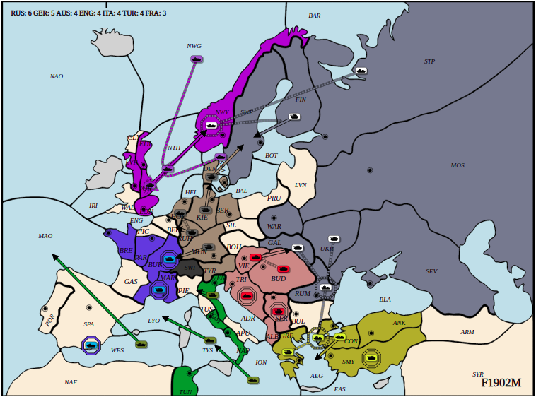
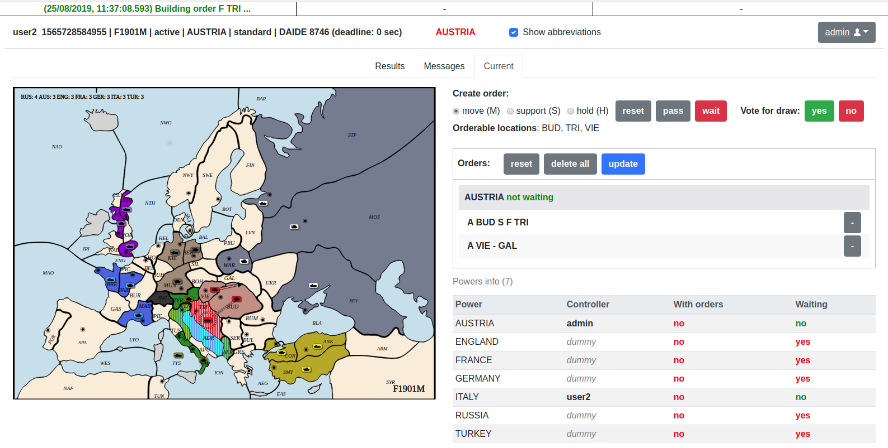
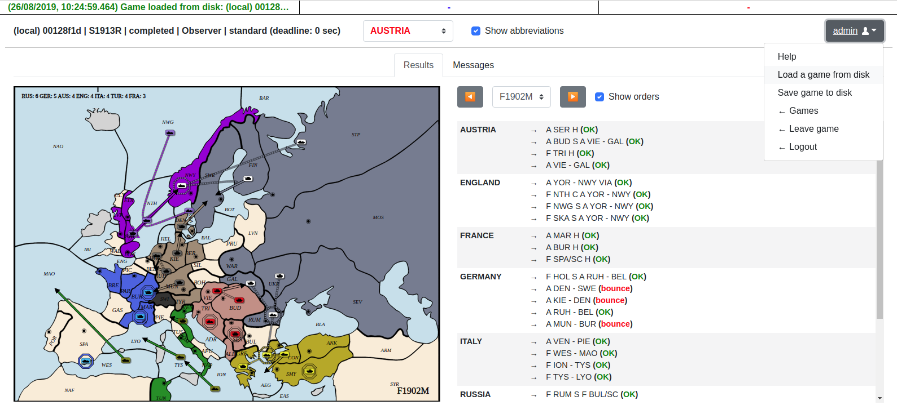

This is a fork of the [Diplomacy Game Engine](https://github.com/diplomacy/diplomacy)

## Environment Setup

1. Download and install uv and pnpm (node version 20.11.1)
1. Run `uv sync` from project root
1. Install pre-commit hooks: `uvx pre-commit install`
1. Copy `.env.example` to `.env` and fill in the values
1. Navigate to `diplomacy/web` and run `pnpm install`
1. Start the BE: `uv run -m diplomacy.server.run`
1. Start the FE: `cd diplomacy/web && pnpm start`
1. Run a bot: `uv run -m bots.dummy_bot`
1. Run a crewai bot: `uv run -m bots.crewbot`

## Euphorie
euphorie is a terminal jupyter-notebook tool that can be started with this command
`uv run --with-editable . euporie-notebook bots/notebooks/test.ipynb`

Euphorie Commands:
```
Ctrl+E   run cell
Ctrl+R   run cell and go to next
Alt+Enter run cell and insert below
```

# Running

## Run `pick_best_orders_crew` CLI Test Harness

Use this CLI test harness to execute the full crew or one element in isolation:

```bash
uv run -m spec.pick_best_orders_crew --help
```

Required arguments:

1. `--element`: `crew`, `game_state_assessor_agent`, `order_agent`, or `taunt_agent`
1. `--mock-input`: JSON source as a file path, `-` (stdin), or inline JSON string

Optional arguments:

1. `--num-tests`: number of independent runs to execute (default: `1`)
1. `--max-concurrency`: max number of concurrent runs (default: same as `--num-tests`)
1. `--include-taunt`: include taunt task when running `taunt_agent`
1. `--pretty`: pretty-print JSON output

Examples:

```bash
# Run game state assessor with input from file
uv run -m spec.pick_best_orders_crew \
  --element=game_state_assessor_agent \
  --mock-input=spec/mocks/1.json \
  --pretty

# Run order agent (assessor context is executed first automatically)
uv run -m spec.pick_best_orders_crew \
  --element=order_agent \
  --mock-input=spec/mocks/1.json \
  --pretty

# Run taunt agent (must enable taunt task)
uv run -m spec.pick_best_orders_crew \
  --element=taunt_agent \
  --include-taunt \
  --mock-input=spec/mocks/1.json \
  --pretty

# Run full crew
uv run -m spec.pick_best_orders_crew \
  --element=crew \
  --mock-input=spec/mocks/1.json \
  --pretty

# Run 10 assessor generations concurrently
uv run -m spec.pick_best_orders_crew \
  --element=game_state_assessor_agent \
  --mock-input=spec/mocks/1.json \
  --num-tests=10 \
  --pretty

# Run 10 tests with concurrency capped at 3
uv run -m spec.pick_best_orders_crew \
  --element=game_state_assessor_agent \
  --mock-input=spec/mocks/1.json \
  --num-tests=10 \
  --max-concurrency=3 \
  --pretty
```

The command outputs JSON with:

1. `output`: element result
1. `metadata.latency_ms`: execution latency
1. `metadata.dependency_latency_ms`: latency from prerequisite context task(s), when applicable
1. `metadata.input_token_length`, `output_token_length`, `total_token_length`: token metrics when available from CrewAI
1. `metadata.input_char_length`, `output_char_length`: always present
1. `metadata.queued_messages`: for taunt runs

Notes:

1. `order_agent` and `taunt_agent` runs execute the assessor task first to provide context.
1. Token metrics are available for full crew runs; task-level runs may report null token counts depending on CrewAI output fields.
1. Common typo alias supported: `--element=game_state_assessor_agen`.
1. With `--num-tests > 1`, output shape is batch mode: top-level `summary` and `runs`.
1. Batch runs create separate Langfuse observations with run index metadata.

# Original Readme Contents

# Diplomacy: DATC-Compliant Game Engine [](https://travis-ci.org/diplomacy/diplomacy) [](https://diplomacy.readthedocs.io/en/latest/?badge=latest)

This project contains an open-source DATC-compliant Diplomacy game engine, a client-server architecture for network play, a web interface to play against bots and to visualize games, and a DAIDE-compatible adapter to connect DAIDE bots to the server.

<p align="center">
  
</p>

## Documentation

The complete documentation is available at [diplomacy.readthedocs.io](https://diplomacy.readthedocs.io/).

## Getting Started

### Installation

The latest version of the package can be installed with:

```python3
pip install diplomacy
```

The package is compatible with Python 3.5, 3.6, and 3.7.

### Running a game

The following script plays a game locally by submitting random valid orders until the game is completed.

```python3
import random
from diplomacy import Game
from diplomacy.utils.export import to_saved_game_format

# Creating a game
# Alternatively, a map_name can be specified as an argument. e.g. Game(map_name='pure')
game = Game()
while not game.is_game_done:

    # Getting the list of possible orders for all locations
    possible_orders = game.get_all_possible_orders()

    # For each power, randomly sampling a valid order
    for power_name, power in game.powers.items():
        power_orders = [random.choice(possible_orders[loc]) for loc in game.get_orderable_locations(power_name)
                        if possible_orders[loc]]
        game.set_orders(power_name, power_orders)

    # Messages can be sent locally with game.add_message
    # e.g. game.add_message(Message(sender='FRANCE',
    #                               recipient='ENGLAND',
    #                               message='This is a message',
    #                               phase=self.get_current_phase(),
    #                               time_sent=int(time.time())))

    # Processing the game to move to the next phase
    game.process()

# Exporting the game to disk to visualize (game is appended to file)
# Alternatively, we can do >> file.write(json.dumps(to_saved_game_format(game)))
to_saved_game_format(game, output_path='game.json')
```

## Web interface

It is also possible to install a web interface in React to play against bots and/or other humans and to visualize games.

The web interface can be installed with:

```bash
# Install NVM
curl -o- https://raw.githubusercontent.com/nvm-sh/nvm/v0.34.0/install.sh | bash

# Clone repo
git clone https://github.com/diplomacy/diplomacy.git

# Install package locally
# You may want to install it in a conda or virtualenv environment
cd diplomacy/
pip install -r requirements_dev.txt

# Build node modules
cd diplomacy/web
npm install .
npm install . --only=dev

# In a terminal window or tab - Launch React server
npm start

# In another terminal window or tab - Launch diplomacy server
python -m diplomacy.server.run
```

The web interface will be accessible at http://localhost:3000.

To login, users can use admin/password or username/password. Additional users can be created by logging in with a username that does not exist in the database.



### Visualizing a game

It is possible to visualize a game by using the "Load a game from disk" menu on the top-right corner of the web interface.




## Network Game

It is possible to join a game remotely over a network using websockets. The script below plays a game over a network.

Note. The server must be started with `python -m diplomacy.server.run` for the script to work.

```python3
import asyncio
import random
from diplomacy.client.connection import connect
from diplomacy.utils import exceptions

POWERS = ['AUSTRIA', 'ENGLAND', 'FRANCE', 'GERMANY', 'ITALY', 'RUSSIA', 'TURKEY']

async def create_game(game_id, hostname='localhost', port=8432):
    """ Creates a game on the server """
    connection = await connect(hostname, port)
    channel = await connection.authenticate('random_user', 'password')
    await channel.create_game(game_id=game_id, rules={'REAL_TIME', 'NO_DEADLINE', 'POWER_CHOICE'})

async def play(game_id, power_name, hostname='localhost', port=8432):
    """ Play as the specified power """
    connection = await connect(hostname, port)
    channel = await connection.authenticate('user_' + power_name, 'password')

    # Waiting for the game, then joining it
    while not (await channel.list_games(game_id=game_id)):
        await asyncio.sleep(1.)
    game = await channel.join_game(game_id=game_id, power_name=power_name)

    # Playing game
    while not game.is_game_done:
        current_phase = game.get_current_phase()

        # Submitting orders
        if game.get_orderable_locations(power_name):
            possible_orders = game.get_all_possible_orders()
            orders = [random.choice(possible_orders[loc]) for loc in game.get_orderable_locations(power_name)
                      if possible_orders[loc]]
            print('[%s/%s] - Submitted: %s' % (power_name, game.get_current_phase(), orders))
            await game.set_orders(power_name=power_name, orders=orders, wait=False)

        # Messages can be sent with game.send_message
        # await game.send_game_message(message=game.new_power_message('FRANCE', 'This is the message'))

        # Waiting for game to be processed
        while current_phase == game.get_current_phase():
            await asyncio.sleep(0.1)

    # A local copy of the game can be saved with to_saved_game_format
    # To download a copy of the game with messages from all powers, you need to export the game as an admin
    # by logging in as 'admin' / 'password'

async def launch(game_id):
    """ Creates and plays a network game """
    await create_game(game_id)
    await asyncio.gather(*[play(game_id, power_name) for power_name in POWERS])

if __name__ == '__main__':
    asyncio.run(launch(game_id=str(random.randint(1, 1000))))

```
## License

This project is licensed under the APGLv3 License - see the [LICENSE](LICENSE) file for details
